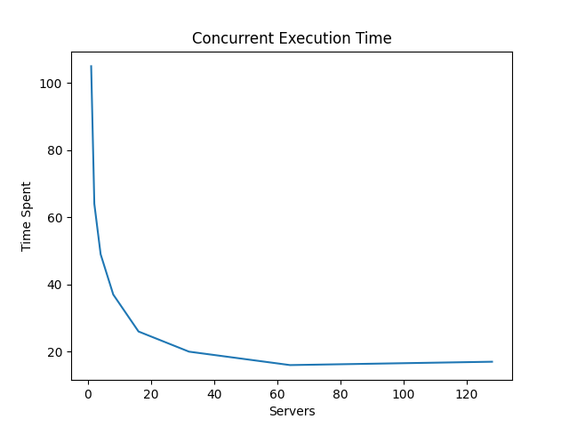

# Command and Argument Injection Concurrent Test Suite  

```
usage: laxTestSuite.py [-h] [--fixed_app | --no-fixed_app] [--verbosity VERBOSITY] [--ports PORTS] [--nginx | --no-nginx]

options:
  -h, --help            show this help message and exit
  --fixed_app, --no-fixed_app
                        Run the TestSuite on the fixed application (default: True)
  --verbosity VERBOSITY
                        Verbosity Level - 0: Doesn't print anything, 1: Prints only failure, 2: Prints all
  --ports PORTS         Set the ports of your servers
  --nginx, --no-nginx   Test the application on the nginx container (default: False)
```

## Multiple Standard PHP Servers
If executed without the nginx option, the script tests the application concurrently on standard PHP servers.
These are opened on the specified ports, by default [10000, 10001, 10002, 10003].

### Example of Usage
```python3 laxTestSuite.py```

## Nginx + PHP FPM Server
Image used: https://github.com/richarvey/nginx-php-fpm

If executed with the nginx option, the script tests the application concurrently on a container.

**You have to build and run the container before starting**:

```docker build -t rich_fpm_server . && docker run rich_fpm_server```

### Example of Usage
```python3 laxTestSuite.py --nginx```

# Execution Time 
Increasing the number of servers can be very useful to have a faster execution, but having too many servers is useless and can be also less efficient:

  

# Possible Refinements
This script is made for educational purposes and may be incomplete or improvable.
A possible refinement for sure is a better visualization of results, involving:
- results collected in a structured way in a dictionary,
- results better visualized through a tabular view.
Another thing to do is to release resources also if the user stops the execution manually.